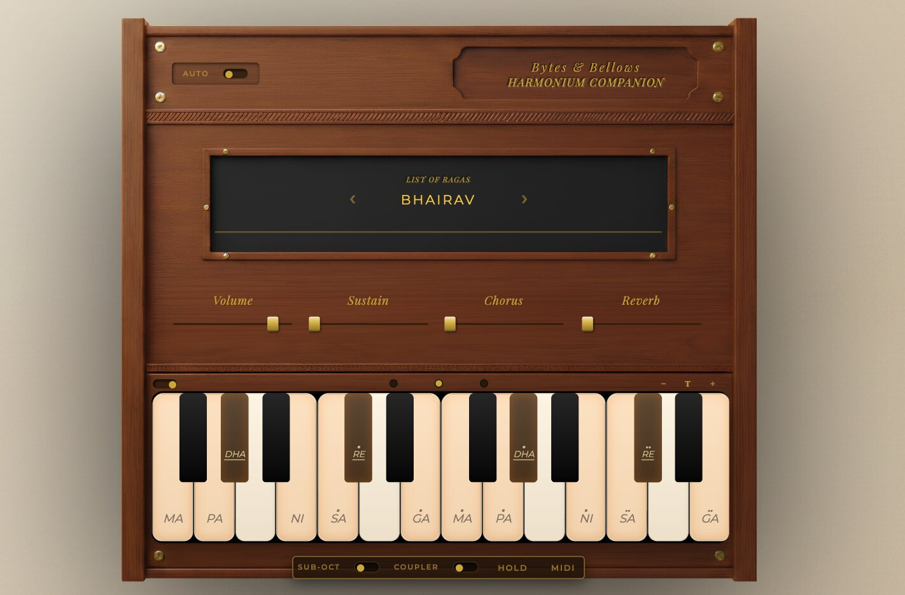

# 🎹 Harmonium Companion

Play in the browser 🎹 — [Live Demo](https://ledlaux.github.io/harmonium-companion/)  

---

## 🛠 Features
* **Auto / Manual Bellows**: Real-time air reservoir simulation (requires pumping for sound).
* **Learn Ragas**: Color-coded highlighting and note filtering for 12+ Indian Ragas (Morning, Evening, Night).
* **Dual Notation**: Toggle between Sargam (Sa, Re, Ga) and Western notation.
* **Octave Coupler**: Includes Sub-Octave and Coupler modes for richer textures.
* **Drone Mode**: Continues note holding. 
* **Effects**: Adjustable Chorus and Reverb to experiment with acoustics.
* **MIDI Support**: WebMIDI plug-and-play.

* **In development:** pwa mobile app, .mid file loading and visual keyboard player, midi cc.

---

## ⌨️ Controls
| Action | Input |
| :--- | :--- |
| **Play Notes** | Keyboard and MIDI |
| **Pump Bellows** | Spacebar |
| **Hold notes** | Shift key |
| **Keyboard scroll** | Right click and drag |
| **Filter notes** | Click raga name |
| **Disable note labels** | Right click label switch |

---

## 🧰 Technical Stack
* **Core**: [Spessasynth](https://github.com/spessasus/spessasynth_core) for SF2 processing and Web Audio synthesis.
* **Graphics**: HTML5 Canvas for waveform visualization.

---

## 📜 License

This project is licensed under the MIT License. See the LICENSE file for details.
